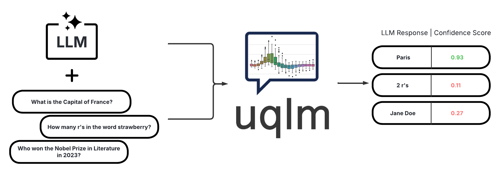
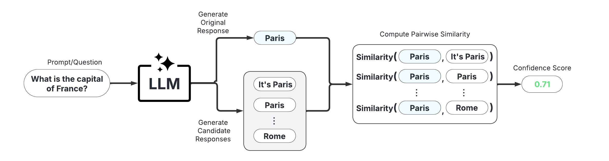
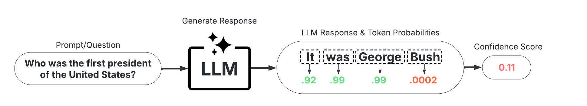
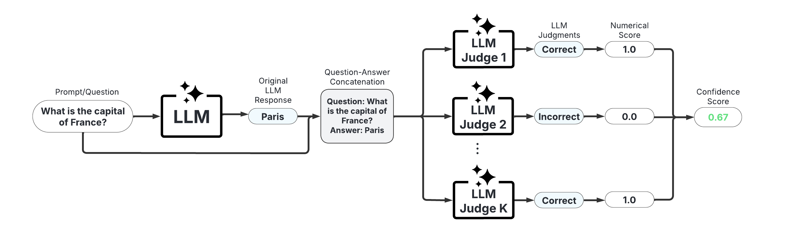
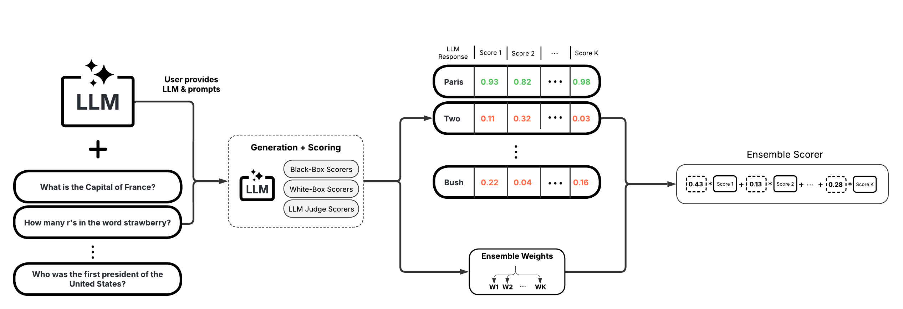

<p align="center">
  <picture>
    <source media="(prefers-color-scheme: dark)" srcset="assets/images/uqlm_flow_ds_dark.png">
    <source media="(prefers-color-scheme: light)" srcset="assets/images/uqlm_flow_ds.png">
    
  </picture>
</p>

<h1 align="center">uqlm: Uncertainty Quantification for Language Models</h1>

<p align="center">
  <a href="https://github.com/cvs-health/uqlm/actions">
    
  </a>
  
  <a href="https://pypi.org/project/uqlm/">
    
  </a>
  
  <a href="https://cvs-health.github.io/uqlm/latest/index.html">
    
  </a>
  <a href="https://pypi.org/project/uqlm/">
    
  </a>
  <a href="https://opensource.org/licenses/Apache-2.0">
    
  </a>
  <a href="https://discord.gg/RjcrAPw43H">
    
  </a>
  <a href="https://github.com/astral-sh/uv">
    
  </a>
  <a href="https://github.com/astral-sh/ruff">
    
  </a>
</p>
<p align="center">
  <a href="https://www.jmlr.org/papers/v27/25-1557.html">
    
  </a>
  <a href="https://openreview.net/pdf?id=WOFspd4lq5">
    
  </a>
  </a>
  <a href="https://openreview.net/pdf?id=gngp4Zz9Sj">
    
  </a>
</p>

UQLM is a Python library for Large Language Model (LLM) hallucination detection using state-of-the-art uncertainty quantification techniques. 

## Installation
The latest version can be installed from PyPI:

```bash
pip install uqlm
```

## Hallucination Detection
UQLM provides a suite of response-level scorers for quantifying the uncertainty of Large Language Model (LLM) outputs. Each scorer returns a confidence score between 0 and 1, where higher scores indicate a lower likelihood of errors or hallucinations.  We categorize these scorers into different types:


| Scorer Type            | Added Latency                                      | Added Cost                               | Compatibility                                             | Off-the-Shelf / Effort                                  |
|------------------------|----------------------------------------------------|------------------------------------------|-----------------------------------------------------------|---------------------------------------------------------|
| [Black-Box Scorers](#black-box-scorers-consistency-based)      | ⏱️ Medium-High (multiple generations & comparisons)           | 💸 High (multiple LLM calls)             | 🌍 Universal (works with any LLM)                         | ✅ Off-the-shelf |
| [White-Box Scorers](#white-box-scorers-token-probability-based)      | ⚡ Minimal\* (token probabilities already returned)   | ✔️ None\* (no extra LLM calls)             | 🔒 Limited (requires access to token probabilities)       | ✅ Off-the-shelf            |
| [LLM-as-a-Judge Scorers](#llm-as-a-judge-scorers) | ⏳ Low-Medium (additional judge calls add latency)    | 💵 Low-High (depends on number of judges)| 🌍 Universal (any LLM can serve as judge)                     |✅  Off-the-shelf        |
| [Ensemble Scorers](#ensemble-scorers)       | 🔀 Flexible (combines various scorers)       | 🔀 Flexible (combines various scorers)      | 🔀 Flexible (combines various scorers)                    | ✅  Off-the-shelf (beginner-friendly); 🛠️ Can be tuned (best for advanced users)    |
| [Long-Text Scorers](#long-text-scorers-claim-level)        | ⏱️ High-Very high (multiple generations & claim-level comparisons)       | 💸 High (multiple LLM calls)      | 🌍 Universal               | ✅ Off-the-shelf    |


<sup><sup> \*Does not apply to multi-generation white-box scorers, which have higher cost and latency. </sup></sup>

Below we provide illustrative code snippets and details about available scorers for each type.

### Black-Box Scorers (Consistency-Based)

These scorers assess uncertainty by measuring the consistency of multiple responses generated from the same prompt. They are compatible with any LLM, intuitive to use, and don't require access to internal model states or token probabilities.

<p align="center">
  <picture>
    <source media="(prefers-color-scheme: dark)" srcset="assets/images/black_box_graphic_dark.png">
    <source media="(prefers-color-scheme: light)" srcset="assets/images/black_box_graphic.png">
    
  </picture>
</p>

**Example Usage:**
Below is a sample of code illustrating how to use the `BlackBoxUQ` class to conduct hallucination detection.

```python
from langchain_openai import ChatOpenAI
llm = ChatOpenAI(model="gpt-4o-mini")

from uqlm import BlackBoxUQ
bbuq = BlackBoxUQ(llm=llm, scorers=["semantic_negentropy"], use_best=True)

results = await bbuq.generate_and_score(prompts=prompts, num_responses=5)
results.to_df()
```
<p align="center">
  
</p>

Above, `use_best=True` implements mitigation so that the uncertainty-minimized responses is selected. Note that although we use `ChatOpenAI` in this example, any [LangChain Chat Model](https://js.langchain.com/docs/integrations/chat/) may be used. For a more detailed demo, refer to our [Black-Box UQ Demo](./examples/black_box_demo.ipynb). 


**Available Scorers:**

*   Discrete Semantic Entropy ([Farquhar et al., 2024](https://www.nature.com/articles/s41586-024-07421-0); [Bouchard & Chauhan, 2025](https://arxiv.org/abs/2504.19254))
*   Number of Semantic Sets ([Lin et al., 2024](https://arxiv.org/abs/2305.19187); [Vashurin et al., 2025](https://arxiv.org/abs/2406.15627); [Kuhn et al., 2023](https://arxiv.org/pdf/2302.09664))
*   Non-Contradiction Probability ([Chen & Mueller, 2023](https://arxiv.org/abs/2308.16175); [Lin et al., 2024](https://arxiv.org/abs/2305.19187); [Manakul et al., 2023](https://arxiv.org/abs/2303.08896))
*   Entailment Probability ([Chen & Mueller, 2023](https://arxiv.org/abs/2308.16175); [Lin et al., 2024](https://arxiv.org/abs/2305.19187); [Manakul et al., 2023](https://arxiv.org/abs/2303.08896))
*   Exact Match ([Cole et al., 2023](https://arxiv.org/abs/2305.14613); [Chen & Mueller, 2023](https://arxiv.org/abs/2308.16175))
*   BERTScore ([Manakul et al., 2023](https://arxiv.org/abs/2303.08896); [Zheng et al., 2020](https://arxiv.org/abs/1904.09675))
*   Cosine Similarity ([Shorinwa et al., 2024](https://arxiv.org/abs/2412.05563))
*   Code-adapted scorers via [`CodeGenUQ`](#code-generation-uq).

### White-Box Scorers (Token-Probability-Based)

These scorers leverage token probabilities to estimate uncertainty.  They offer single-generation scoring, which is significantly faster and cheaper than black-box methods, but require access to the LLM's internal probabilities, meaning they are not necessarily compatible with all LLMs/APIs.

<p align="center">
  <picture>
    <source media="(prefers-color-scheme: dark)" srcset="assets/images/white_box_graphic_dark.png">
    <source media="(prefers-color-scheme: light)" srcset="assets/images/white_box_graphic.png">
    
  </picture>
</p>

**Example Usage:**
Below is a sample of code illustrating how to use the `WhiteBoxUQ` class to conduct hallucination detection. 

```python
from langchain_google_vertexai import ChatVertexAI
llm = ChatVertexAI(model='gemini-2.5-pro')

from uqlm import WhiteBoxUQ
wbuq = WhiteBoxUQ(llm=llm, scorers=["min_probability"])

results = await wbuq.generate_and_score(prompts=prompts)
results.to_df()
```
<p align="center">
  
</p>

Again, any [LangChain Chat Model](https://js.langchain.com/docs/integrations/chat/) may be used in place of `ChatVertexAI`. For more detailed examples, refer to our demo notebooks on [Single-Generation White-Box UQ](https://github.com/cvs-health/uqlm/blob/main/examples/white_box_single_generation_demo.ipynb) and/or [Multi-Generation White-Box UQ](https://github.com/cvs-health/uqlm/blob/main/examples/white_box_multi_generation_demo.ipynb).


**Single-Generation Scorers (minimal latency, zero extra cost):**

*   Minimum token probability ([Manakul et al., 2023](https://arxiv.org/abs/2303.08896))
*   Length-Normalized Sequence Probability ([Malinin & Gales, 2021](https://arxiv.org/pdf/2002.07650))
*   Sequence Probability ([Vashurin et al., 2024](https://arxiv.org/abs/2406.15627))
*   Mean Top-K Token Negentropy ([Scalena et al., 2025](https://arxiv.org/abs/2510.11170); [Manakul et al., 2023](https://arxiv.org/abs/2303.08896))
*   Min Top-K Token Negentropy ([Scalena et al., 2025](https://arxiv.org/abs/2510.11170); [Manakul et al., 2023](https://arxiv.org/abs/2303.08896))
*   Probability Margin ([Farr et al., 2024](https://arxiv.org/abs/2408.08217))

**Self-Reflection Scorers (one additional generation per response):**

*   P(True) ([Kadavath et al., 2022](https://arxiv.org/abs/2207.05221))

**Multi-Generation Scorers (several additional generations per response):**

*   Monte carlo sequence probability ([Kuhn et al., 2023](https://arxiv.org/abs/2302.09664))
*   Consistency and Confidence (CoCoA) ([Vashurin et al., 2025](https://arxiv.org/abs/2502.04964))
*   Semantic Entropy ([Farquhar et al., 2024](https://www.nature.com/articles/s41586-024-07421-0)) 
*   Semantic Density ([Qiu et al., 2024](https://arxiv.org/abs/2405.13845))

### LLM-as-a-Judge Scorers

These scorers use one or more LLMs to evaluate the reliability of the original LLM's response.  They offer high customizability through prompt engineering and the choice of judge LLM(s).

<p align="center">
  <picture>
    <source media="(prefers-color-scheme: dark)" srcset="assets/images/judges_graphic_dark.png">
    <source media="(prefers-color-scheme: light)" srcset="assets/images/judges_graphic.png">
    
  </picture>
</p>

**Example Usage:**
Below is a sample of code illustrating how to use the `LLMPanel` class to conduct hallucination detection using a panel of LLM judges. 

```python
from langchain_ollama import ChatOllama
llama = ChatOllama(model="llama3")
mistral = ChatOllama(model="mistral")
qwen = ChatOllama(model="qwen3")

from uqlm import LLMPanel
panel = LLMPanel(llm=llama, judges=[llama, mistral, qwen])

results = await panel.generate_and_score(prompts=prompts)
results.to_df()
```
<p align="center">
  
</p>

Note that although we use `ChatOllama` in this example, we can use any [LangChain Chat Model](https://js.langchain.com/docs/integrations/chat/) as judges. For a more detailed demo illustrating how to customize a panel of LLM judges, refer to our [LLM-as-a-Judge Demo](./examples/judges_demo.ipynb).


**Available Scorers:**

*   Categorical LLM-as-a-Judge ([Manakul et al., 2023](https://arxiv.org/abs/2303.08896); [Chen & Mueller, 2023](https://arxiv.org/abs/2308.16175); [Luo et al., 2023](https://arxiv.org/abs/2303.15621))
*   Continuous LLM-as-a-Judge ([Xiong et al., 2024](https://arxiv.org/abs/2306.13063))
*   Likert Scale LLM-as-a-Judge ([Bai et al., 2023](https://arxiv.org/pdf/2306.04181))
*   Panel of LLM Judges ([Verga et al., 2024](https://arxiv.org/abs/2404.18796))

### Ensemble Scorers

These combine multiple individual scorers via weighted averaging to produce more robust uncertainty estimates. They are highly customizable for specific use cases and can be used off-the-shelf with fixed weights (unsupervised) or trained for optimal performance (supervised). The following workflow demonstrates the supervised training process. 

<p align="center">
  <picture>
    <source media="(prefers-color-scheme: dark)" srcset="assets/images/uqensemble_generate_score_dark.png">
    <source media="(prefers-color-scheme: light)" srcset="assets/images/uqensemble_generate_score.png">
    
  </picture>
</p>

**Example Usage:**
Below is a sample of code illustrating how to use the `UQEnsemble` class to conduct hallucination detection. 

```python
from langchain_openai import AzureChatOpenAI
llm = AzureChatOpenAI(deployment_name="gpt-4o", openai_api_type="azure", openai_api_version="2024-12-01-preview")

from uqlm import UQEnsemble
## ---Option 1: Off-the-Shelf Ensemble---
# uqe = UQEnsemble(llm=llm)
# results = await uqe.generate_and_score(prompts=prompts, num_responses=5)

## ---Option 2: Tuned Ensemble---
scorers = [ # specify which scorers to include
    "exact_match", "noncontradiction", # black-box scorers
    "min_probability", # white-box scorer
    llm # use same LLM as a judge
]
uqe = UQEnsemble(llm=llm, scorers=scorers)

# Tune on tuning prompts with provided ground truth answers
tune_results = await uqe.tune(
    prompts=tuning_prompts, ground_truth_answers=ground_truth_answers
)
# ensemble is now tuned - generate responses on new prompts
results = await uqe.generate_and_score(prompts=prompts)
results.to_df()
```
<p align="center">
  
</p>

As with the other examples, any [LangChain Chat Model](https://js.langchain.com/docs/integrations/chat/) may be used in place of `AzureChatOpenAI`. For more detailed demos, refer to our [Off-the-Shelf Ensemble Demo](./examples/ensemble_off_the_shelf_demo.ipynb) (quick start) or our [Ensemble Tuning Demo](./examples/ensemble_tuning_demo.ipynb) (advanced).


**Available Scorers:**

*   BS Detector ([Chen & Mueller, 2023](https://arxiv.org/abs/2308.16175))
*   Supervised UQ Ensemble ([Bouchard & Chauhan, 2025](https://arxiv.org/abs/2504.19254))


### Long-Text Scorers (Claim-Level)

These scorers take a fine-grained approach and score confidence/uncertainty at the claim or sentence level. An extension of [black-box scorers](#black-box-scorers-consistency-based), long-text scorers sample multiple responses to the same prompt, decompose the original response into claims or sentences, and evaluate consistency of each original claim/sentence with the sampled responses.

<p align="center">
  <picture>
    <source media="(prefers-color-scheme: dark)" srcset="assets/images/luq_example_dark.png">
    <source media="(prefers-color-scheme: light)" srcset="assets/images/luq_example.png">
    
  </picture>
</p>

After scoring claims in the response, the response can be refined by removing claims with confidence scores less than a specified threshold and reconstructing the response from the retained claims. This approach allows for improved factual precision of long-text generations. 

<p align="center">
  <picture>
    <source media="(prefers-color-scheme: dark)" srcset="assets/images/uad_graphic_dark.png">
    <source media="(prefers-color-scheme: light)" srcset="assets/images/uad_graphic.png">
    
  </picture>
</p>

**Example Usage:**
Below is a sample of code illustrating how to use the `LongTextUQ` class to conduct claim-level hallucination detection and uncertainty-aware response refinement.

```python
from langchain_openai import ChatOpenAI
llm = ChatOpenAI(model="gpt-4o")

from uqlm import LongTextUQ
luq = LongTextUQ(llm=llm, scorers=["entailment"], response_refinement=True)

results = await luq.generate_and_score(prompts=prompts, num_responses=5)
results_df = results.to_df()
results_df

# Preview the data for a specific claim in the first response
# results_df["claims_data"][0][0]
# Output:
# {
#   'claim': 'Suthida Bajrasudhabimalalakshana was born on June 3, 1978.',
#   'removed': False,
#   'entailment': 0.9548099517822266
# }
```
<p align="center">
  
</p>

Above `response` and `entailment` reflect the original response and response-level confidence score, while `refined_response` and `refined_entailment` are the corresponding values after response refinement. The `claims_data` column includes granular data for each response, including claims, claim-level confidence scores, and whether each claim is retained in the response refinement process. We use `ChatOpenAI` in this example, any [LangChain Chat Model](https://js.langchain.com/docs/integrations/chat/) may be used. For a more detailed demo, refer to our [Long-Text UQ Demo](./examples/long_text_uq_demo.ipynb).


**Available Scorers:**

*   LUQ scorers ([Zhang et al., 2024](https://arxiv.org/abs/2403.20279); [Zhang et al., 2025](https://arxiv.org/abs/2410.13246))
*   Graph-based scorers ([Jiang et al., 2024](https://arxiv.org/abs/2410.20783))
*   Generalized long-form semantic entropy ([Farquhar et al., 2024](https://www.nature.com/articles/s41586-024-07421-0))


### Code Generation UQ

For code-generation tasks, UQLM provides `CodeGenUQ`, a specialized interface for predicting whether LLM-generated code is functionally correct without requiring execution. `CodeGenUQ` includes white-box scorers, code-adapted black-box scorers based on functional equivalence, and reflexive self-evaluation scorers. The white-box methods are the same token-probability-based scorers available through `WhiteBoxUQ`. 

**Example Usage:**

```python
from langchain_openai import ChatOpenAI
llm = ChatOpenAI(model="gpt-4o-mini")

from uqlm import CodeGenUQ
cguq = CodeGenUQ(
    llm=llm,
    scorers=["functional_equivalence_rate"]
)

results = await cguq.generate_and_score(prompts=prompts, num_responses=5)
results.to_df()
```

For a more detailed demo, refer to our [`CodeGenUQ` Demo](./examples/codegen_demo.ipynb). More details on code generation scorers are available in [Bouchard et al., 2026](https://arxiv.org/abs/2605.28500).

## Documentation
Check out our [documentation site](https://cvs-health.github.io/uqlm/latest/index.html) for detailed instructions on using this package, including API reference and more.

## Example notebooks and tutorials

UQLM comes with a comprehensive set of example notebooks to help you get started with different uncertainty quantification approaches. These examples demonstrate how to use UQLM for various tasks, from basic hallucination detection to advanced ensemble methods.

**[Browse all example notebooks →](https://github.com/cvs-health/uqlm/blob/main/examples/)**

The examples directory contains tutorials for:
- Black-box and white-box uncertainty quantification
- Single and multi-generation approaches
- LLM-as-a-judge techniques
- Ensemble methods
- State-of-the-art techniques like Semantic Entropy and Semantic Density
- Multimodal uncertainty quantification
- Score calibration

Each notebook includes detailed explanations and code samples that you can adapt to your specific use case.


## Citation
A technical description of the `uqlm` scorers and extensive experimental results are presented in **[this paper](https://openreview.net/pdf?id=WOFspd4lq5)**, published in **Transactions on Machine Learning Research (TMLR)**. If you use our framework or toolkit, please cite:

```bibtex
@article{
bouchard2025uncertainty,
title={Uncertainty Quantification for Language Models: A Suite of Black-Box, White-Box, {LLM} Judge, and Ensemble Scorers},
author={Dylan Bouchard and Mohit Singh Chauhan},
journal={Transactions on Machine Learning Research},
issn={2835-8856},
year={2025},
url={https://openreview.net/forum?id=WOFspd4lq5},
note={}
}
```

The `uqlm` software package is described in this **[this paper](https://arxiv.org/abs/2507.06196)**, published in the **Journal of Machine Learning Research (JMLR)**. If you use the software, please cite:

```bibtex
@article{JMLR:v27:25-1557,
  author  = {Dylan Bouchard and Mohit Singh Chauhan and David Skarbrevik and Ho-Kyeong Ra and Viren Bajaj and Zeya Ahmad},
  title   = {UQLM: A Python Package for Uncertainty Quantification in Large Language Models},
  journal = {Journal of Machine Learning Research},
  year    = {2026},
  volume  = {27},
  number  = {13},
  pages   = {1--10},
  url     = {http://jmlr.org/papers/v27/25-1557.html}
}
```

The long-text methods and experiment results are described in **[this paper](https://openreview.net/pdf?id=gngp4Zz9Sj)**, published in **Transactions on Machine Learning Research (TMLR)**. If you use our long-form UQ methods, please cite:
```bibtex
@article{
bouchard2026finegrained,
title={Fine-Grained Uncertainty Quantification for Long-Form Language Model Outputs: A Comparative Study},
author={Dylan Bouchard and Mohit Singh Chauhan and Viren Bajaj and David Skarbrevik},
journal={Transactions on Machine Learning Research},
issn={2835-8856},
year={2026},
url={https://openreview.net/forum?id=gngp4Zz9Sj},
note={}
}
```

The code-specific methods and experiment results are described in [**this paper**](https://arxiv.org/abs/2605.28500), available as a preprint on arXiv. To cite:
```bibtex
@misc{bouchard2026functionalentropypredictingfunctional,
      title={Functional Entropy: Predicting Functional Correctness in LLM-Generated Code with Uncertainty Quantification}, 
      author={Dylan Bouchard and Mohit Singh Chauhan and Zeya Ahmad and Ho-Kyeong Ra},
      year={2026},
      eprint={2605.28500},
      archivePrefix={arXiv},
      primaryClass={cs.CL},
      url={https://arxiv.org/abs/2605.28500}, 
}
```
